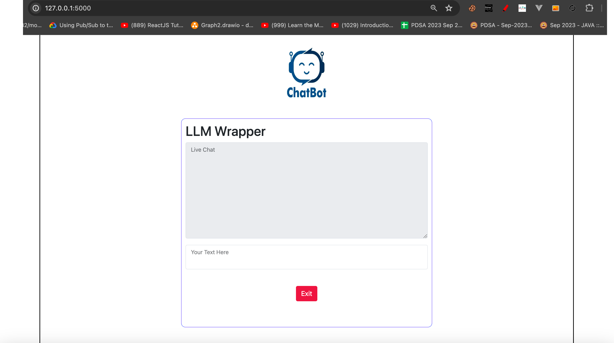

# How to install and run LLM Wrapper

These are very brief, likely incomplete, installation instructions. If you want to install the system, follow these instructions as they are and send any questions to <induvemulakonda@gmail.com>.

These instructions assume comfort with Python, Flask(backend), and REST API. You may have a difficult time installing the system if you do not have at least some experience with all three of them.

## Steps

1. Installed Python version 3.11 or above.

2. Clone the repository :
   ```
   $ git clone https://github.com/Indu-Vemulakonda/HCL-Assessment.git
   ```
3. Then change the directory to `cd HCL-Assessment`.

4. Configure `virutal environment` and activate for local development environment. Then try `pip install -r requirements.txt` for all dependencies installation.
5. Run the web app using below command.
   ```
       $python app.py
   ```
6. Navigate to url http://127.0.0.1:5000.

<center></center>

7. Flask REST API is documented in `API Doc for LLM_Wrapper.yaml` and tested API end points using https://editor.swagger.io/ .

<center></center>

Perform brilliant analysis, fix our broken code, document how the system works, and otherwise contribute to the project.
